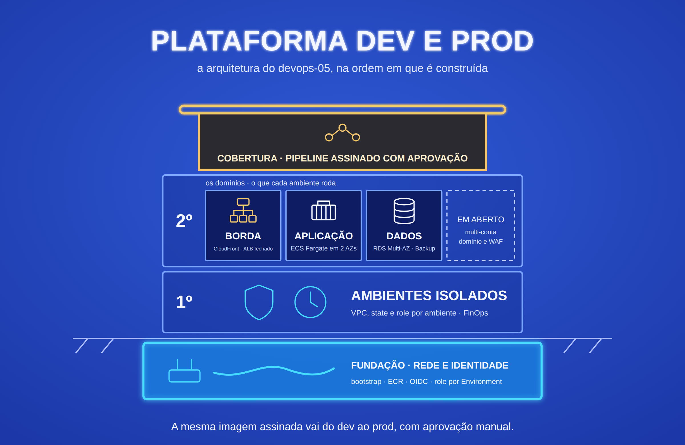

# devops-05-platform

Plataforma com dois ambientes na AWS, dev e prod, isolados por VPC, state e
permissão. A mesma imagem, assinada no build, passa pelo dev e só chega ao
prod depois de uma aprovação manual. O prod tem banco Multi-AZ com failover
testado, backup diário com restauração medida e HTTPS na borda com
CloudFront. O dev custa menos e desliga sozinho fora do horário comercial.

**Projeto 5 de 5 do portfólio DevOps** · Nível: avançado ·
Anterior: [devops-04-serverless-finops](https://github.com/robson-devops/devops-04-serverless-finops)


## Stack

`Terraform` `AWS ECS Fargate` `RDS PostgreSQL Multi-AZ` `CloudFront` `ALB` `AWS Backup` `EventBridge Scheduler` `AWS Budgets` `ECR` `GitHub Actions` `GitHub Environments` `OIDC` `cosign` `Trivy` `gitleaks` `checkov` `tflint` `Python 3.13` `FastAPI`

## O que este projeto acrescenta aos anteriores

| Projetos 1 a 4 | Projeto 5 |
|---|---|
| Um ambiente | dev e prod, com a mesma composição e parâmetros diferentes |
| Uma role do pipeline por projeto | Role de build só para a `main` e uma role de deploy por GitHub Environment |
| Imagem identificada pela tag | Imagem identificada pelo digest, assinada no build e conferida antes de cada deploy |
| Deploy automático direto | dev automático; prod só depois de aprovação manual |
| HTTP no ALB (projeto 2) | HTTPS no CloudFront e ALB que só aceita o CloudFront |
| RDS single-AZ | prod Multi-AZ, com failover forçado e medido |
| Backups automáticos do RDS, nunca restaurados | AWS Backup diário e restauração testada, com RPO e RTO medidos |
| FinOps como projeto à parte (projeto 4) | Orçamento por ambiente e dev desligado fora do horário |

## Arquitetura

Diagramas e fluxos em [`docs/architecture.md`](docs/architecture.md).

```
usuário ──HTTPS──> CloudFront ──HTTP + cabeçalho secreto──> ALB (só aceita CloudFront)
          ──> ECS Fargate (subnets privadas) ──TLS──> RDS PostgreSQL (subnets de dados)

push na main ──> lint, testes, Trivy, SBOM ──> push no ECR ──> cosign sign
          ──> deploy dev (confere assinatura) ──> aprovação ──> deploy prod (confere assinatura)
```

Camadas do Terraform, cada uma com o seu state:

| Camada | O que cria | State |
|---|---|---|
| `bootstrap/` | Bucket do state | Local |
| `terraform/shared/` | ECR, provider OIDC, roles do pipeline | `shared/terraform.tfstate` |
| `terraform/envs/dev/` | Rede, banco, ALB, CloudFront, ECS, horário comercial, orçamento | `envs/dev/terraform.tfstate` |
| `terraform/envs/prod/` | O mesmo do dev, com Multi-AZ e AWS Backup | `envs/prod/terraform.tfstate` |

## Decisões de Arquitetura

**Uma conta, ambientes isolados.** Separar dev e prod em contas é o padrão
de mercado, mas exige AWS Organizations, e uma conta fechada leva 90 dias
para sumir. Aqui o isolamento é por VPC (10.50.0.0/16 e 10.60.0.0/16, sem
peering), por state, por role de deploy e por tag. O caminho para
multi-conta está em [`docs/producao.md`](docs/producao.md).

**Dev e prod com o mesmo código.** Os dois ambientes chamam o módulo
`platform` e só mudam parâmetros: NAT, Multi-AZ, quantidade de tasks,
backup e horário comercial. O que foi testado no dev é a mesma
infraestrutura que roda no prod, em outra escala.

**Camada shared.** O ECR é um só: a imagem promovida para o prod é
exatamente a que passou pelo dev, pelo mesmo digest. O provider OIDC é único
por conta e as roles do pipeline precisam existir antes dos ambientes.

**A role de deploy é presa ao GitHub Environment.** A role do prod só aceita
um token com `sub` igual a `repo:robson-devops/devops-05-platform:environment:prod`.
O GitHub só emite esse token para um job que declarou o ambiente `prod` e
passou pela aprovação. Uma branch com o workflow alterado não consegue
assumir a role do prod. A role de build só aceita a `main` e não faz deploy.

**Imagem assinada, deploy pelo digest.** O build assina a imagem com cosign,
sem chave guardada: a identidade é o workflow `app.yml` na `main`, atestada
pelo OIDC do GitHub. Cada deploy confere a assinatura antes de registrar a
task definition, que aponta para `repositório@sha256:...`. Uma imagem
enviada ao ECR por fora do pipeline não chega a nenhum ambiente.

**O pipeline não aplica Terraform.** Ele valida a infraestrutura em todo
push (fmt, validate, tflint, checkov), mas quem aplica é o operador. Aplicar
pelo pipeline exige uma role com poder de criar IAM, o que pede mais
controles. Como fazer isso está em [`docs/producao.md`](docs/producao.md).

**HTTPS na borda, sem domínio próprio.** O CloudFront entrega HTTPS com o
certificado `*.cloudfront.net`. O ALB aceita só a prefix list de origem do
CloudFront e encaminha só as requisições com o cabeçalho `X-Origin-Verify`;
o resto recebe 403. O trecho CloudFront → ALB é HTTP, porque sem domínio o
ALB não tem certificado. Domínio, ACM e HTTPS até a origem estão em
[`docs/producao.md`](docs/producao.md).

**Três camadas de rede.** ALB na subnet pública, tasks na privada de
aplicação (saída pelo NAT) e banco na privada de dados, sem rota para a
internet. O banco aceita conexões só do security group das tasks e recusa
conexão sem TLS (`rds.force_ssl`).

**Senha do banco fora do Terraform.** Com `manage_master_user_password`, a
AWS gera a senha no Secrets Manager e faz a rotação. O ECS injeta só a chave
`password` no container. A senha não passa pelo código, pela task definition
nem pelo state.

**Dev barato, prod resiliente.** O dev usa um NAT, banco single-AZ e uma
task, e o EventBridge Scheduler desliga aplicação e banco às 19h e religa às
8h, de segunda a sexta. O prod usa um NAT por AZ, banco Multi-AZ e duas
tasks, uma em cada AZ.

**Backup que foi restaurado.** O AWS Backup faz um backup diário do banco do
prod, com retenção de 7 dias. O `scripts/testar-restauracao.sh` restaura o
ponto mais recente numa instância temporária, mede RPO e RTO e apaga a
instância. Backup que nunca foi restaurado é só uma hipótese.

**Orçamento por ambiente.** Um AWS Budget por ambiente, filtrado pela tag
`Environment`, avisa por e-mail quando a previsão passa do limite e quando o
gasto real chega a 80%. O e-mail fica no `terraform.tfvars`, fora do Git.

## Trade-offs Avaliados

| Decisão | Escolhido | Alternativa | Critério |
|---|---|---|---|
| Isolamento dos ambientes | Uma conta com VPC, state e role por ambiente | Uma conta por ambiente | Organizations e o fechamento de contas não cabem no laboratório |
| Estrutura do Terraform | Uma pasta por ambiente e um módulo de composição | Workspaces | State e backend explícitos por ambiente; o diretório mostra onde se está aplicando |
| HTTPS | CloudFront com certificado padrão | ACM no ALB com domínio próprio | Sem custo de domínio; o laboratório pode ser reproduzido por qualquer pessoa |
| Proteção da origem | Prefix list do CloudFront e cabeçalho secreto | CloudFront VPC Origin com ALB interno | VPC Origin cria um security group gerenciado pela AWS que pode impedir o destroy da VPC |
| Saída das tasks | NAT Gateway | VPC endpoints | NAT custa menos que 5 endpoints de interface por AZ |
| Assinatura da imagem | cosign keyless | Chave KMS | Nada para guardar nem rotacionar; a identidade é o workflow |
| Verificação da assinatura | No pipeline, antes do deploy | Política de admissão no ECS | O ECS não verifica assinatura nativamente |
| Teste de restauração | Script sob demanda | Restore testing do AWS Backup | Roda na hora do teste e mostra RPO e RTO na tela; o agendado está em `docs/producao.md` |
| Desligar o dev | EventBridge Scheduler direto nas APIs | Lambda (projeto 4) | Sem código: o Scheduler chama `ecs:UpdateService` e `rds:StopDBInstance` |

## Melhorias Mensuráveis

Os números são preenchidos depois da validação na AWS, seguindo
[`docs/validacao-aws.md`](docs/validacao-aws.md).

| Métrica | Resultado |
|---|---|
| Failover do RDS Multi-AZ: maior janela sem banco vista pela aplicação | a medir |
| Restauração do backup: RPO (idade do ponto) | a medir |
| Restauração do backup: RTO (pedido até a instância disponível) | a medir |
| Pipeline: push até a nova versão no dev | a medir |
| Pipeline: aprovação até a nova versão no prod | a medir |
| Acesso direto ao ALB | bloqueado no security group; sem o cabeçalho, 403 (a confirmar) |
| Imagem sem assinatura | deploy recusado (a confirmar) |
| Custo por hora com os dois ambientes no ar | a medir |
| Encerramento completo (`encerrar.sh`) | a medir |
| Recursos na conta depois do encerramento | a medir |

## Limitações Conhecidas

- **HTTP entre o CloudFront e o ALB.** O trecho passa pela rede da AWS, mas
  sem TLS. Resolve com domínio próprio e certificado ACM no ALB.
- **Cabeçalho secreto no state.** O valor do `X-Origin-Verify` é gerado pelo
  Terraform e fica no state, que é cifrado e privado. A rotação é manual.
- **Dev desligado não aceita `terraform apply`.** Com o RDS parado, mudanças
  no banco falham. Ligue o banco antes (`aws rds start-db-instance`).
- **Orçamento depende da tag de custo.** A tag `Environment` precisa estar
  ativada no Billing, e os dados de custo chegam com até 24 horas de atraso.
- **A restauração mede só a camada de dados.** Para a aplicação usar o banco
  restaurado, é preciso trocar o `DB_HOST` na task definition.
- **Sem alarmes de aplicação.** O projeto 3 cobre observabilidade e alertas;
  aqui o foco é a plataforma. O que acrescentar está em `docs/producao.md`.
- **Uma região.** Recuperação de desastre entre regiões está em
  `docs/producao.md`.
- **Schema criado no startup.** Suficiente para uma tabela; migrações com
  Alembic entram quando o schema evoluir.

## Estrutura

```
.
├── app/                          # API FastAPI + Dockerfile
├── bootstrap/                    # bucket do state (state local)
├── terraform/
│   ├── shared/                   # ECR, OIDC e roles do pipeline
│   ├── envs/
│   │   ├── dev/                  # parâmetros do dev
│   │   └── prod/                 # parâmetros do prod
│   └── modules/
│       ├── platform/             # composição usada pelos dois ambientes
│       ├── network/              # VPC com 3 camadas, NAT e flow logs
│       ├── database/             # RDS PostgreSQL
│       ├── load_balancer/        # ALB restrito ao CloudFront
│       ├── cdn/                  # CloudFront
│       ├── ecs_service/          # cluster, task definition e serviço
│       ├── backup/               # AWS Backup
│       ├── office_hours/         # liga e desliga por horário
│       ├── budget/               # orçamento por ambiente
│       ├── ecr/ · github_oidc/ · pipeline_role/
├── scripts/
│   ├── testar-failover.sh        # failover do RDS medido pela aplicação
│   ├── testar-restauracao.sh     # restauração com RPO e RTO
│   ├── encerrar.sh               # apaga tudo na ordem certa
│   └── verificar-cobranca.sh     # confere que nada ficou na conta
├── .github/workflows/
│   ├── app.yml                   # build, testes, varredura, assinatura e promoção
│   ├── deploy.yml                # deploy reutilizado por dev e prod
│   ├── infra.yml                 # fmt, validate, tflint e checkov
│   └── seguranca.yml             # gitleaks no histórico
└── docs/                         # arquitetura, validação e caminho para produção
```

## Custo

Os ambientes cobram por hora enquanto existem. Valores aproximados da
us-east-1:

| Item | dev | prod |
|---|---|---|
| NAT Gateway | 1 × US$ 0,045 | 2 × US$ 0,045 |
| RDS db.t3.micro | US$ 0,018 | US$ 0,036 (Multi-AZ) |
| ALB | US$ 0,0225 | US$ 0,0225 |
| Fargate 0,25 vCPU / 0,5 GB | 1 × ~US$ 0,012 | 2 × ~US$ 0,012 |
| IPv4 público (NAT e ALB) | 3 × US$ 0,005 | 4 × US$ 0,005 |
| **Total por hora** | **~US$ 0,11** | **~US$ 0,19** |

Com os dois no ar, cerca de US$ 0,30 por hora, ou US$ 7 por dia. CloudFront,
ECR, AWS Backup, Scheduler e Budgets ficam em centavos nesse volume. Fora do
horário comercial, o dev deixa de pagar banco e tasks, mas o NAT e o ALB
continuam. Para o laboratório: subir, validar e encerrar no mesmo dia.

## Pré-requisitos

### Ferramentas

Terraform 1.14 ou mais novo, AWS CLI, GitHub CLI (`gh`), `git`, `jq` e
`python3` (os dois últimos para o teste de restauração).

### Identidades

| Identidade | O que é | Como obter |
|---|---|---|
| **Operador** | Quem aplica o Terraform e roda os testes | Usuário IAM seu. Precisa de permissão em VPC/EC2, ELB, CloudFront, ECS, ECR, RDS, Secrets Manager, IAM (roles e provider OIDC), S3, CloudWatch Logs, AWS Backup, EventBridge Scheduler, Budgets e Cost Explorer. Numa conta de laboratório, `AdministratorAccess` |
| **Build** | Job que publica e assina a imagem | Role `devops-05-pipeline-build`, criada pela camada shared |
| **Deploy dev / prod** | Job de deploy de cada ambiente | Roles `devops-05-pipeline-dev` e `devops-05-pipeline-prod`, criadas pela camada shared |
| **Aprovador** | Quem libera o deploy no prod | Seu usuário do GitHub, cadastrado como revisor do Environment `prod` |

### Login na AWS e no GitHub

```bash
aws configure            # ou aws configure sso + aws sso login
aws sts get-caller-identity
gh auth login
```

### Provider OIDC do GitHub

Ele é único por conta. Se outro projeto já o criou, aplique a camada shared
com `-var create_oidc_provider=false`:

```bash
aws iam list-open-id-connect-providers \
  --query "OpenIDConnectProviderList[?contains(Arn, 'token.actions.githubusercontent.com')].Arn" \
  --output text
```

### Se você fez fork

Troque `robson-devops/devops-05-platform` pelo seu repositório na variável
`github_repository` de `terraform/shared/variables.tf` e nos comandos `gh`.

## Como executar

Todos os comandos rodam da raiz do projeto, na região us-east-1.

**1. Bootstrap.** Cria o bucket do state, com state local.

```bash
terraform -chdir=bootstrap init
terraform -chdir=bootstrap apply
```

**2. Camada shared.** ECR, provider OIDC e roles do pipeline.

```bash
terraform -chdir=terraform/shared init \
  -backend-config="bucket=$(terraform -chdir=bootstrap output -raw state_bucket_name)"
terraform -chdir=terraform/shared apply
```

**3. GitHub.** Secret da role de build, os dois Environments com o secret da
role de deploy de cada um e a aprovação obrigatória no `prod`:

```bash
REPO=robson-devops/devops-05-platform

gh secret set AWS_BUILD_ROLE_ARN \
  --repo "$REPO" \
  --body "$(terraform -chdir=terraform/shared output -raw build_role_arn)"

gh api --method PUT "repos/$REPO/environments/dev"

gh api --method PUT "repos/$REPO/environments/prod" \
  --input - <<EOF
{
  "reviewers": [{"type": "User", "id": $(gh api user --jq .id)}],
  "prevent_self_review": false
}
EOF

for env in dev prod; do
  gh secret set AWS_DEPLOY_ROLE_ARN \
    --repo "$REPO" \
    --env "$env" \
    --body "$(terraform -chdir=terraform/shared output -json deploy_role_arn | jq -r ".$env")"
done
```

Revisor obrigatório em Environment de repositório privado exige plano pago
do GitHub; em repositório público é gratuito.

**4. Tag de custo.** Ativa a tag `Environment` para o filtro dos orçamentos.
A tag só aparece no Billing depois que algum recurso com ela gerar custo; se
o comando responder que a tag não existe, rode de novo no dia seguinte.

```bash
aws ce update-cost-allocation-tags-status \
  --cost-allocation-tags-status TagKey=Environment,Status=Active
```

**5. Primeira imagem.** O push na `main` dispara o workflow Aplicação. O
build publica e assina a imagem. Os jobs de deploy só avisam que o serviço
ainda não existe. Aprove o do `prod` mesmo assim, para a execução terminar
com sucesso. Depois pegue o SHA da imagem publicada:

```bash
IMAGE_TAG=$(gh run list \
  --repo robson-devops/devops-05-platform \
  --workflow app.yml \
  --branch main \
  --status success \
  --limit 1 \
  --json headSha \
  --jq '.[0].headSha')
echo "$IMAGE_TAG"
```

**6. Ambiente dev.** O e-mail do orçamento fica no `terraform.tfvars`, que
não vai para o Git.

```bash
cp terraform/envs/dev/terraform.tfvars.example terraform/envs/dev/terraform.tfvars
# edite alert_email

terraform -chdir=terraform/envs/dev init \
  -backend-config="bucket=$(terraform -chdir=bootstrap output -raw state_bucket_name)"
terraform -chdir=terraform/envs/dev apply -var image_tag="$IMAGE_TAG"

gh variable set APP_URL \
  --repo robson-devops/devops-05-platform \
  --env dev \
  --body "$(terraform -chdir=terraform/envs/dev output -raw app_url)"
```

O CloudFront leva alguns minutos para ficar pronto; o `apply` espera.

**7. Ambiente prod.** Mesmos passos, na pasta do prod:

```bash
cp terraform/envs/prod/terraform.tfvars.example terraform/envs/prod/terraform.tfvars
# edite alert_email

terraform -chdir=terraform/envs/prod init \
  -backend-config="bucket=$(terraform -chdir=bootstrap output -raw state_bucket_name)"
terraform -chdir=terraform/envs/prod apply -var image_tag="$IMAGE_TAG"

gh variable set APP_URL \
  --repo robson-devops/devops-05-platform \
  --env prod \
  --body "$(terraform -chdir=terraform/envs/prod output -raw app_url)"
```

**8. Daí em diante.** Todo push em `app/` passa pelo build, vai sozinho para o
dev e espera a sua aprovação para ir ao prod, com a mesma imagem.

```bash
APP_URL=$(terraform -chdir=terraform/envs/dev output -raw app_url)
curl -s "$APP_URL/health"
curl -s -X POST "$APP_URL/tasks" \
  -H 'Content-Type: application/json' \
  -d '{"title":"primeira tarefa"}'
curl -s "$APP_URL/tasks"
```

### Testes de resiliência

```bash
./scripts/testar-failover.sh       # failover do RDS do prod, medido pela aplicação
./scripts/testar-restauracao.sh    # restaura o backup mais recente e mede RPO e RTO
```

Procedimento completo: [`docs/validacao-aws.md`](docs/validacao-aws.md).

### Encerrar sem deixar nada na conta

```bash
./scripts/encerrar.sh
./scripts/verificar-cobranca.sh us-east-1
```

O `encerrar.sh` apaga uma eventual instância de teste de restauração, depois
prod, dev, as revisões de task definition registradas pelo pipeline, a
camada shared e o bootstrap. Esperado no fim do `verificar-cobranca.sh`:
`Nada encontrado nas regiões verificadas nem nos serviços globais.`

### Validação local

```bash
terraform fmt -check -recursive
for dir in bootstrap terraform/shared terraform/envs/dev terraform/envs/prod; do
  terraform -chdir="$dir" init -backend=false -input=false >/dev/null
  terraform -chdir="$dir" validate
done
tflint --init && tflint --recursive --config "$PWD/.tflint.hcl"
checkov -d . --framework terraform github_actions --quiet --compact
```
