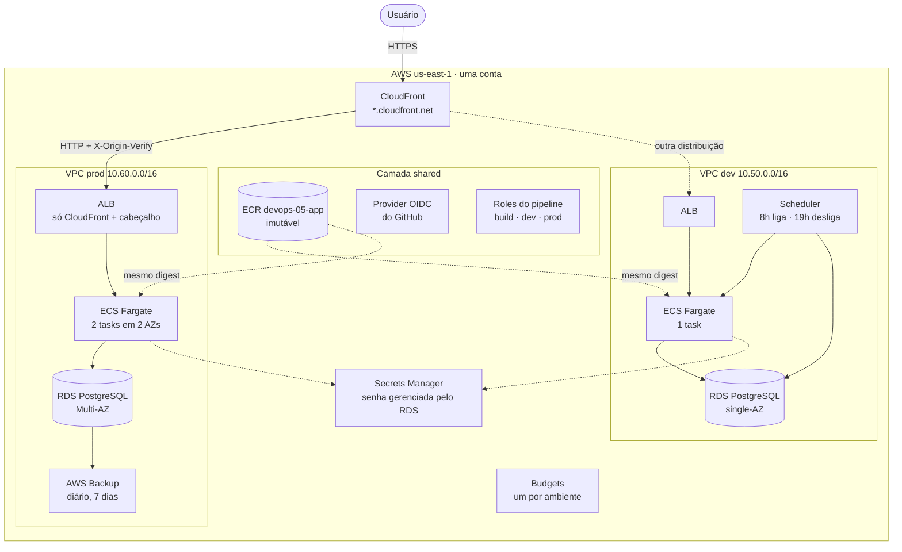
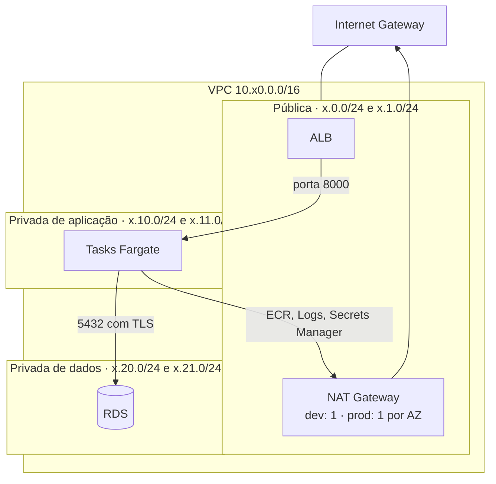
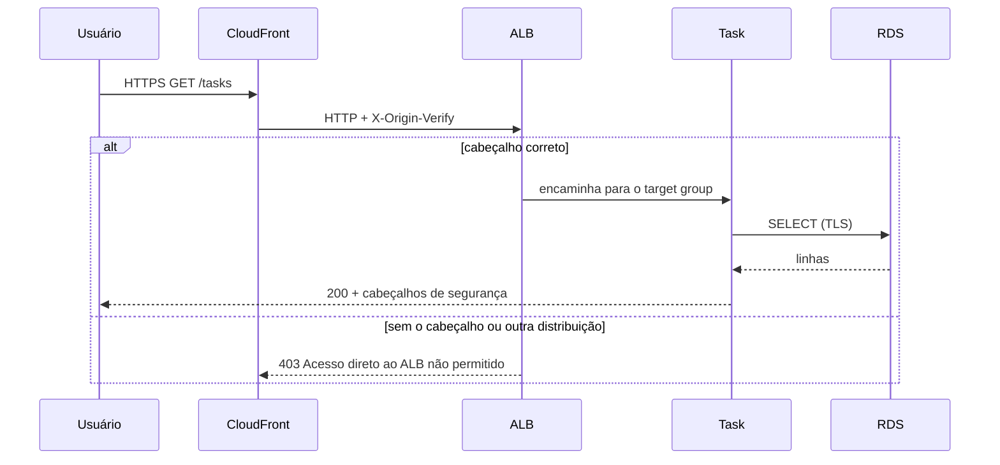
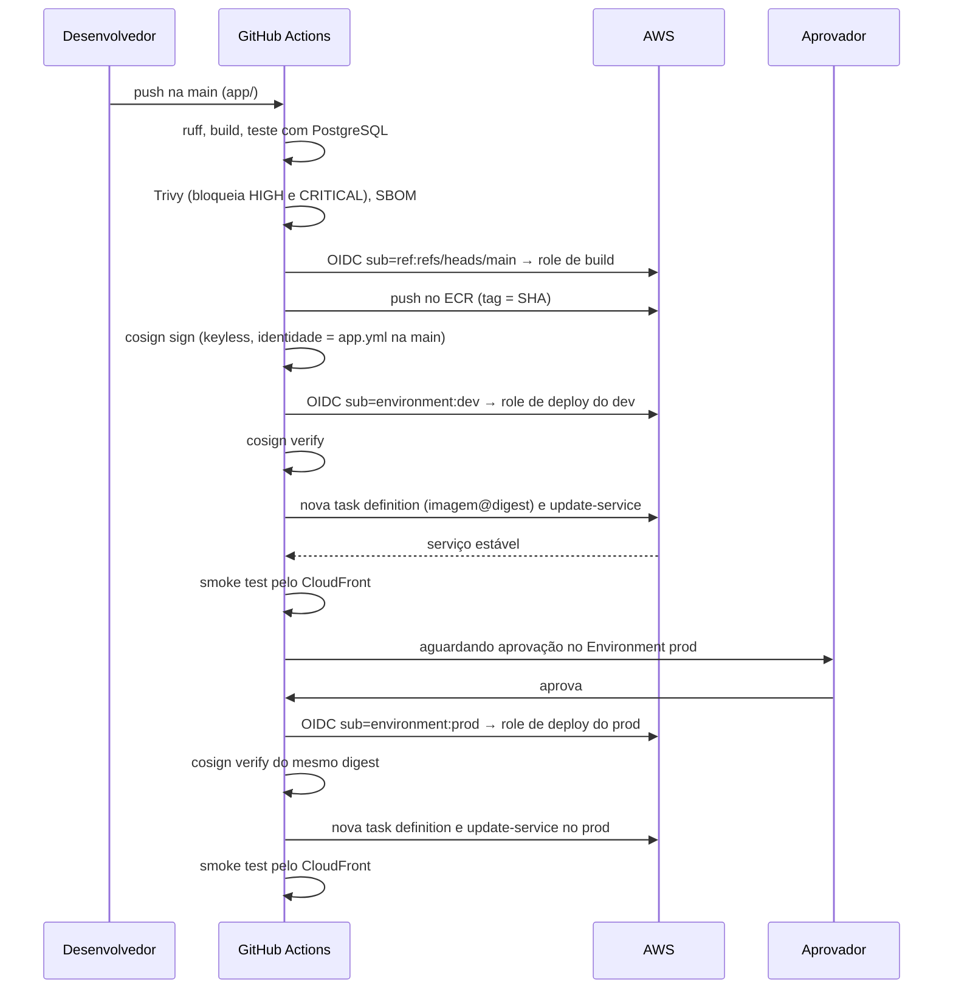
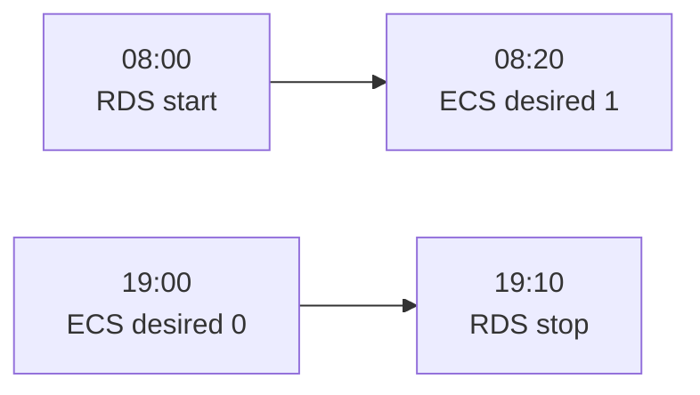
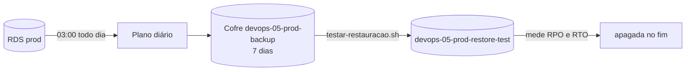

# Arquitetura: devops-05-platform

## Visão geral

Cada ambiente tem a sua distribuição CloudFront; o diagrama mostra uma só
para não repetir o caminho.

## Rede de um ambiente

| Security group | Entrada | Saída |
|---|---|---|
| ALB | 80 a partir da prefix list `com.amazonaws.global.cloudfront.origin-facing` | 8000 para o CIDR da VPC |
| Tasks | 8000 a partir do SG do ALB | Tudo (NAT e banco) |
| Banco | 5432 a partir do SG das tasks | Nenhuma regra |
| Default da VPC | Esvaziado | Esvaziado |

A subnet de dados não tem rota para a internet. A tabela de rotas de
aplicação é uma por AZ: no prod, cada AZ sai pelo próprio NAT e a perda de
uma zona não derruba a saída da outra.

## Caminho de uma requisição

A prefix list do CloudFront aceita qualquer distribuição de qualquer conta.
O cabeçalho é o que prova que a requisição veio da nossa.

## Pipeline e promoção

| Workflow | Quando roda | O que faz |
|---|---|---|
| `seguranca.yml` | Todo push e PR | gitleaks em todo o histórico |
| `infra.yml` | Mudança em `bootstrap/` ou `terraform/` | fmt, validate nas 4 raízes, tflint e checkov |
| `app.yml` | Mudança em `app/` | lint, build, testes, Trivy, SBOM, push, assinatura e promoção |
| `deploy.yml` | Chamado pelo `app.yml` | verifica a assinatura e faz o deploy num ambiente |

### Permissões das roles do pipeline

| Role | Quem assume (`sub`) | Pode |
|---|---|---|
| `devops-05-pipeline-build` | `repo:...:ref:refs/heads/main` | Push e leitura no repositório ECR |
| `devops-05-pipeline-dev` | `repo:...:environment:dev` | Ler imagem; registrar task definition; atualizar só serviços do cluster `devops-05-dev`; `iam:PassRole` só em `devops-05-dev-*` para `ecs-tasks` |
| `devops-05-pipeline-prod` | `repo:...:environment:prod` | O mesmo, limitado a `devops-05-prod` |

A role do dev não atualiza o serviço do prod nem passa as roles do prod para
uma task definition.

## Horário comercial do dev

De segunda a sexta, no fuso America/Sao_Paulo. O EventBridge Scheduler chama
as APIs direto, sem Lambda, com uma role que só alcança aquele serviço e
aquela instância. O banco liga antes e desliga depois da aplicação, para as
tasks nunca subirem sem banco. O Terraform ignora o `desired_count` do
serviço, então um `apply` não religa o ambiente.

## Backup e restauração

O cofre usa `force_destroy`: o destroy apaga os pontos de recuperação junto.
Sem isso, o cofre com pontos ficaria para trás.
